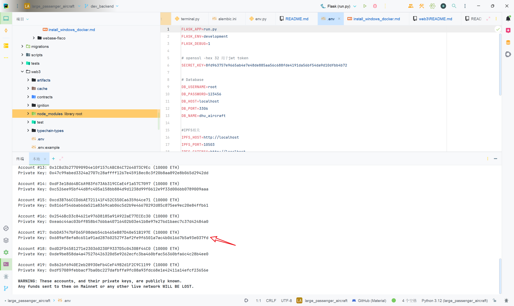
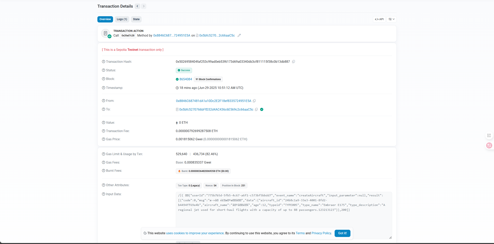

# 启动项目

## 安装uv

```bash
pip install uv 
```

## 安装依赖

```bash
uv sync 
```

## 配置环境变量

1. 配置数据库链接信息

```bash
cp .env.example .env
```

2. 自行创建数据库

- 只要创建数据库即可,不需要`create table`
- 创建完数据库自行填写`.env`文件夹的相关信息

## 执行数据库迁移

### pull

- **建议每次pull代码的时候执行一下(不执行默认第一次启动应用的时候自动执行)**
- **不要手动去修改数据库表结构!要修改表结构在[models](app%2Fmodels)中修改**
- **不要手动去修改数据库表结构!要修改表结构在[models](app%2Fmodels)中修改**
- **不要手动去修改数据库表结构!要修改表结构在[models](app%2Fmodels)中修改**
- **不要手动去修改数据库表结构!要修改表结构在[models](app%2Fmodels)中修改**

```bash
flask db upgrade 
```

### push

- **建议每次push代码的时候执行一下（如果涉及到数据库更改）**

```bash
flask db migrate -m "迁移信息" 
```

## 启动区块链服务

根据[README.md](web3%2FREADME.md)自行启动区块链服务 \
随便找一个`private Key`填入`.env`文件的`PRIVATE_KEY`处:

把合约地址填入到`.env`文件的`CONTRACT_ADDRESS`处


> 也可以把合约部署到sepolia上,执行效果如图


## 启动ipfs分布式文件存储

根据[install_windows_docker.md](docker%2Fmiddleware%2Fipfs%2Finstall_windows_docker.md)自行启动分布式文件存储服务

# 启动Redis+Celery 异步[定时]任务

## 安装redis

[readme.md](docker%2Fmiddleware%2Fredis%2Freadme.md)

## 启动worker

```bash
celery -A app.celery worker  --loglevel=info --pool=solo
```

- windows 下看到如下提示表示启动成功—— windows 加载比较慢,请见谅

```txt
✅ 数据库链接成功
✅ 数据库迁移成功
✅ jwt初始化成功
✅ cors初始化成功
✅ celery初始化成功
✅ running in mode worker
Applied providers: ['CPUExecutionProvider'], with options: {'CPUExecutionProvider': {}}
find model: C:\Users\Administrator/.insightface\models\buffalo_sc\det_500m.onnx detection [1, 3, '?', '?'] 127.5 128.0
Applied providers: ['CPUExecutionProvider'], with options: {'CPUExecutionProvider': {}}
find model: C:\Users\Administrator/.insightface\models\buffalo_sc\w600k_mbf.onnx recognition ['None', 3, 112, 112] 127.5 127.5
set det-size: (640, 640)
 
 -------------- celery@DESKTOP-MVAVNOB v5.5.3 (immunity)
--- ***** ----- 
-- ******* ---- Windows-11-10.0.26100-SP0 2025-06-23 21:59:34
- *** --- * --- 
- ** ---------- [config]
- ** ---------- .> app:         app:0x22bb1616510
- ** ---------- .> transport:   redis://localhost:6379/3
- ** ---------- .> results:     redis://localhost:6379/4
- *** --- * --- .> concurrency: 16 (solo)
-- ******* ---- .> task events: OFF (enable -E to monitor tasks in this worker)
--- ***** ----- 
 -------------- [queues]
                .> celery           exchange=celery(direct) key=celery
                

[tasks]
  . app.schedule.flight.health_check
  . app.worker.faceRecognition.create_user_face_embedding
  . app.worker.faceRecognition.delete_face_embedding
  . app.worker.faceRecognition.get_user_id_by_face

[2025-06-23 21:59:55,254: INFO/MainProcess] Connected to redis://localhost:6379/3
[2025-06-23 22:00:37,369: INFO/MainProcess] mingle: searching for neighbors
[2025-06-23 22:01:41,500: INFO/MainProcess] mingle: all alone
[2025-06-23 22:03:05,683: INFO/MainProcess] celery@DESKTOP-MVAVNOB ready. 
```

## 启动beat

```bash
celery -A app.celery beat  --loglevel=info
```

## pycharm 调试

- 注意script去选到.venv目录下的`celery.exe`
  
  

## 自动测试

- 在[tests](tests)中书写,查看单元测试

```bash
pytest 
```

## 启动项目

```bash
flask run
```

## 调试项目

在`pycharm`做如下配置,打断点调试即可:


## 代码行统计

```bash
.\cloc-2.00.exe . --exclude-dir=.venv,node_modules --exclude-ext=xml,json
```

```markdown
-------------------------------------------------------------------------------
Language                     files          blank        comment           code
-------------------------------------------------------------------------------
Python                         128           1504            931           8457
TypeScript                       9             75             36            712
Markdown                         8            134              0            501
Dockerfile                       3             18             18             87
YAML                             2              1              0             46
Solidity                         1             10              1             42
INI                              1             12              0             38
TOML                             1              0              0             31
Bourne Shell                     3              5              7             22
Mako                             1              7              0             17
JSON                             2              2              0             14
XML                              1              0              0             10
-------------------------------------------------------------------------------
SUM:                           160           1768            993           9977
-------------------------------------------------------------------------------
```

# 使用docker 启动后端

`docker build --build-arg APT_MIRROR_SOURCE=aliyun -t aircraft --network host .`
`docker run --env-file .env  aircraft `