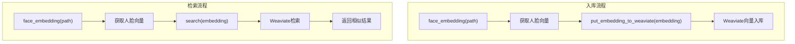

# 人脸识别登录方案
- 向量数据库——`weaviate`
- 模型库——`faceinsight`+`opencv`

```mermaid
flowchart TD
    subgraph 入库流程
        A1["face_embedding(path)"] --> B1[获取人脸向量]
        B1 --> C1["put_embedding_to_weaviate(embedding)"]
        C1 --> D1[Weaviate向量入库]
    end

    subgraph 检索流程
        AA["face_embedding(path)"] --> BB[获取人脸向量]
        BB --> CC["search(embedding)"]
        CC --> DD[Weaviate检索]
        DD --> EE[返回相似结果]
    end
```