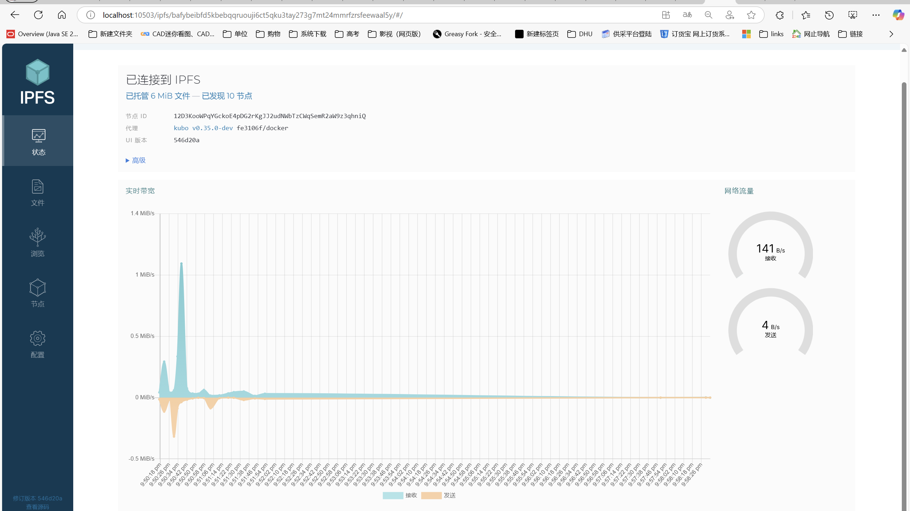

# 安装教程

> 本教程会把`ipfs` 服务变得公网可访问,官网并不推荐这种做法，本教程适用于WINDOWS

# 拉取镜像

```bash
docker pull ipfs/kubo:master-latest
```

# 持久化文件夹

```bash
    cd C:
    mkdir ipfs
    mkdir ipfs_staging
    mkdir ipfs_data
```

# 安装

```bash
 docker run -d --name ipfs_host -v ./ipfs_staging:/export -v ./ipfs_data:/data/ipfs -p 10500:4001 -p 10501:4001/udp -p 8080:8080 -p 10503:5001 ipfs/kubo:master-latest
```

# 进入到容器中

```bash
ipfs config --json API.HTTPHeaders.Access-Control-Allow-Origin '["http://localhost:3000", "https://webui.ipfs.io", "http:
//127.0.0.1:5001","http://localhost:10500","http://localhost:10501","http://localhost:10502","http://localhost:10503","http://localhost:5000"]'


```

# 扩充Windows docker UDP缓冲区

```bash
wsl -d docker-desktop 
sysctl -w net.core.rmem_max=7500000
sysctl -w net.core.wmem_max=7500000    
```

# 访问
```bash
http://localhost:10503/webui
```
